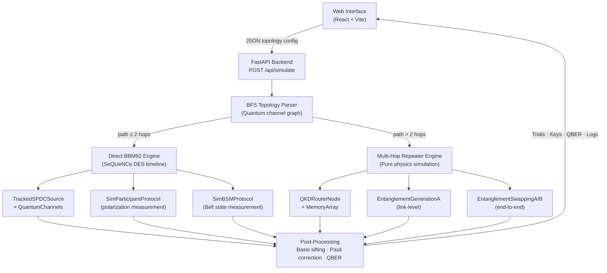

# ChaQra — Quantum Key Distribution Network Simulator

**ChaQra** is a discrete-event quantum network simulator for modeling and analyzing the **BBM92** entanglement-based QKD protocol and multi-hop **quantum repeater networks** under realistic physical channel constraints.

The simulator is built upon the [**SeQUeNCe**](https://sequence-toolbox.github.io/) quantum network simulation framework. It accepts arbitrary user-defined network topologies, selects the appropriate simulation engine (direct single-hop or multi-hop entanglement swapping), and produces sifted key pairs and QBER estimates consistent with the configured physical channel parameters.

**Live Demo**: [quantum-qkd-taupe.vercel.app](https://quantum-qkd-taupe.vercel.app/)

---

## Table of Contents

- [Project Development Chronicle](#project-development-chronicle)
- [System Architecture](#system-architecture)
- [Simulation Engines](#simulation-engines)
- [Visualization Interface](#visualization-interface)
- [Key Equations & Physical Models](#key-equations--physical-models)
- [Experimental Results](#experimental-results)
- [Repository Structure](#repository-structure)
- [Setup & Execution](#setup--execution)

---

## Project Development Chronicle

### Week 1 — Problem Statement & Framework Selection

**Objective**: Establish project scope and select a simulation platform suitable for quantum network discrete-event modeling.

A comparative study of two candidate frameworks was conducted:

| Criterion | NetSquid | SeQUeNCe |
| :--- | :--- | :--- |
| Learning curve | Easier | Steeper |
| Community access | Registration closed | Open-source, active |
| Maintenance | Inactive | Actively maintained |
| Documentation | Limited | Comprehensive |

**Decision**: SeQUeNCe was selected. Its open registration, active development, and modular component model (`Timeline`, `Node`, `Protocol`, `QuantumChannel`, `Memory`) made it the appropriate foundation for this project.

**Artifact**: [`reports/week1.tex`](reports/week1.tex)

---

### Week 2 — Discrete Event Simulation & Component Primitives

**Objective**: Internalize the DES execution model and prototype the foundational network building blocks.

The SeQUeNCe DES kernel operates on three primitives:
- `Timeline` — maintains a priority queue of time-ordered events and advances simulation time
- `Event(t, Process)` — fires a named method call on an object at simulation time `t`
- `Process(obj, 'method', args)` — encapsulates a deferred function call

Practical implementations produced during this week:

| File | Description |
| :--- | :--- |
| [`DES/des.py`](DES/des.py) | Store open/close event loop; demonstrates cascading event scheduling and DES logging |
| [`hardware-module/hardware.py`](hardware-module/hardware.py) | `SenderNode` and `ReceiverNode` with parameterized `Memory` and `Detector` components |
| [`hardware-module/pingpong.py`](hardware-module/pingpong.py) | Bidirectional classical message exchange over `ClassicalChannel` |

Key insight: quantum memory parameters (`fidelity`, `coherence_time`, `efficiency`, `wavelength`, `frequency`) directly govern the fidelity and rate of entanglement operations in downstream simulations.

**Artifact**: [`reports/week2.tex`](reports/week2.tex)

---

### Week 3 — Entanglement Generation & Barrett-Kok Protocol

**Objective**: Understand and simulate the fundamental mechanism for establishing entanglement between spatially separated quantum memories.

**The core problem — exponential photon loss**:

$$P_{\text{trans}}(L) = 10^{-\alpha L / 10}$$

Over 100 km of standard fiber ($\alpha \approx 0.2$ dB/km), transmission probability falls to $\sim 10^{-2}$. Classical signal amplification is forbidden by the **No-Cloning Theorem**: measuring a quantum state for amplification irreversibly collapses the superposition.

**Barrett-Kok Protocol** (3-step procedure for remote entanglement generation):

1. *Initialization*: Each node prepares its memory in superposition $|+\rangle = \frac{1}{\sqrt{2}}(|0\rangle + |1\rangle)$. A laser pulse causes conditional photon emission from $|1\rangle$ only, producing the spin-photon entangled state $\frac{1}{\sqrt{2}}(|0\rangle|\text{vac}\rangle + |1\rangle|\text{photon}\rangle)$.

2. *Path erasure*: The two photons (from nodes $A$ and $B$) interfere on a 50:50 beamsplitter at the central BSM station. A click on either detector erases which-path information, projecting the remote memories into a Bell pair.

3. *50% fundamental limit*: Linear-optics BSMs cannot distinguish all four Bell states. Only $|\Psi^+\rangle$ and $|\Psi^-\rangle$ (anti-symmetric photon bunching) are distinguishable via Hong-Ou-Mandel interference. The symmetric states ($|\Phi^\pm\rangle$) both produce two clicks in the same detector, making them indistinguishable without ancilla photons. This imposes a hard **50% maximum success probability** for any linear-optics BSM.

Simulation outcome across 1000 protocol attempts: $\approx 500:500$ (entangled:failed), confirming the theoretical bound.

**Artifact**: [`entanglement/entanglement.py`](entanglement/entanglement.py), [`reports/week3.tex`](reports/week3.tex)

---

### Week 4 — BBM92 Protocol: Full Implementation

**Objective**: Implement a complete, end-to-end BBM92 QKD pipeline over a simulated lossy fiber link.

**Protocol stages**:
1. Central SPDC source emits polarization-entangled pairs $|\Phi^+\rangle = \frac{1}{\sqrt{2}}(|HH\rangle + |VV\rangle)$
2. Each photon propagates through an independent `QuantumChannel` with configurable attenuation and polarization fidelity
3. Alice and Bob independently choose random measurement bases: $Z$-basis $\{|H\rangle, |V\rangle\}$ or $X$-basis $\{|+\rangle, |-\rangle\}$
4. Basis choices are publicly announced; only matching-basis trials are retained (sifting)
5. A random sample (~15%) of sifted bits is sacrificed to estimate QBER

**Two critical engineering issues encountered and resolved**:

> **Issue 1 — Channel bypass (QBER always 0%)**
>
> `SPDCSource.send_photons()` internally calls `Process(receiver, "get", [photon])` directly on registered receiver objects, bypassing the `QuantumChannel` instance entirely. Neither attenuation loss nor polarization noise was applied.
>
> *Fix*: Subclassed `SPDCSource` as `TrackedSPDCSource` and overrode `send_photons()` to call `owner.send_qubit(dst, photon)`, which correctly invokes `QuantumChannel.transmit()` and applies both loss and polarization flip before scheduling photon arrival.

> **Issue 2 — Poisson zero-emission dropouts (37% silent trials)**
>
> `SPDCSource` draws the photon pair count per emission slot from a Poisson distribution with mean $\lambda = \text{mean\_photon\_num}$. At the default $\lambda = 1.0$, $P(0\text{ pairs}) = e^{-1} \approx 37\%$, causing over a third of trials to produce no photons.
>
> *Fix*: Set `mean_photon_num = 10.0`, reducing silent trial probability to $e^{-10} \approx 0.005\%$.

**Additionally**, each photon was stamped with a unique `trial` index (via `photon.trial = trial`) to enable accurate per-trial basis and result correlation in the global `SIMULATION_TRIALS` dictionary.

**Results** (200 trials, 1 km fiber, polarization fidelity 0.93, attenuation 0.0002 dB/m):
- Sifted key length: 80–110 bits (~45% yield)
- Agreement rate: 93–99%
- QBER: 0–8% (expected ~7% from $1 - p_{\text{fidelity}} = 0.07$; sampling variance from 15% sample over ~12 bits)

**Artifact**: [`bbm92/bbm92.py`](bbm92/bbm92.py), [`reports/week4.tex`](reports/week4.tex)

---

### Weeks 5 & 6 — Full-Stack Simulator: Dynamic Topologies, BSM Nodes & Entanglement Swapping

**Objective**: Generalize the static three-node BBM92 script into a dynamic, web-accessible simulator supporting arbitrary topologies including multi-hop quantum repeater configurations.

**Backend (`backend/main.py`)** — FastAPI service with two runtime-selected simulation engines:

- Accepts a topology description (nodes, components, quantum/classical channels) as a POST request
- Runs BFS path discovery on the quantum channel graph to detect direct vs. multi-hop configurations
- Returns per-trial telemetry: basis choices, measurement results, photon loss flags, BSM outcomes, sifted keys, and QBER

**Additional SeQUeNCe framework integration issues resolved during this phase**:

> **Issue 3 — `FreeQuantumState` non-subscriptable access**
>
> The initial participant protocol attempted `[photon.quantum_state[0], photon.quantum_state[1]]`. `FreeQuantumState` does not support Python subscript indexing, causing a `TypeError` on every measurement attempt. All trials were recorded as lost.
>
> *Fix*: Replaced manual state vector access with the `Photon.measure(basis_matrix, photon, rng)` library call.

> **Issue 4 — 4D→2D state collapse dimension mismatch**
>
> Two entangled photons share a 4-dimensional joint state vector. Calling `Photon.measure` with a 2×2 basis matrix before the physical detector collapsed the state raised `matmul: size 4 is different from 2`.
>
> *Fix*: Reordered execution so `qsdet.get(photon)` fires first, causing the `QSDetectorPolarization` component to project the joint state into a 2D subspace. `Photon.measure` is then called on the already-collapsed state.

**Bell State Measurement node (`SimBSMProtocol`)**: Collects photons from two independent SPDC sources. When both photons of a trial arrive (identified by `photon.trial`), a BSM outcome $\in \{|\Phi^+\rangle, |\Phi^-\rangle, |\Psi^+\rangle, |\Psi^-\rangle\}$ is drawn. If the outcome is $|\Phi^-\rangle$ (1) or $|\Psi^-\rangle$ (3), a classical bit correction $b_B \leftarrow 1 - b_B$ is applied during post-processing to restore key correlation.

**Visualization interface** features a drag-and-drop topology editor, Leaflet GIS map mode (distances computed via Haversine formula), SVG optical component schematics per node, and CSS keyframe photon-travel animations.

**Artifacts**: [`backend/main.py`](backend/main.py), [`frontend/src/App.jsx`](frontend/src/App.jsx), [`reports/week5.tex`](reports/week5.tex)

---

## System Architecture



---

## Simulation Engines

### Engine 1 — Direct BBM92 (≤ 2 hops)

Uses SeQUeNCe's discrete-event timeline. SPDC sources emit $|\Phi^+\rangle$ pairs; photons propagate through `QuantumChannel` objects with configurable attenuation and polarization fidelity. Endpoints run `SimParticipantProtocol`; optional intermediate BSM nodes run `SimBSMProtocol`.

| Component | SeQUeNCe class | Role |
| :--- | :--- | :--- |
| Photon source | `TrackedSPDCSource` | Emits tagged entangled photon pairs |
| Quantum link | `QuantumChannel` | Applies fiber loss and polarization noise |
| Classical link | `ClassicalChannel` | Carries sifting and correction messages |
| Endpoint | `SimParticipantProtocol` | Chooses basis, records measurement |
| Repeater | `SimBSMProtocol` | Joint Bell state measurement |

### Engine 2 — Multi-Hop Quantum Repeater (> 2 hops)

Employs a physics-based Monte Carlo model traversing the discovered BFS path. Each hop's survival probability is sampled independently from the channel attenuation. Memory operations at intermediate repeater nodes contribute additional fidelity degradation ($\times 0.98$ per intermediate hop with 84% memory coupling efficiency). Entanglement swapping is performed at each intermediate node and the outer Alice–Bob pair is correlated accordingly.

| Component | Role |
| :--- | :--- |
| `QKDRouterNode` | Custom `Node` subclass with `MemoryArray` and resource managers |
| `EntanglementGenerationA` | Heralded photon emission to adjacent BSM; installs link-level entanglement |
| `EntanglementSwappingA` | BSM on locally held entangled memories; generates classical correction message |
| `EntanglementSwappingB` | Applies Pauli correction at end node on receipt of swap result |

---

## Visualization Interface

The interface (`frontend/src/App.jsx`) operates in two complementary modes:

**Schematic Canvas** — Drag-and-drop node placement. Nodes are typed (Source, Endpoint, BSM, Router). Channels are drawn as directed edges with quantum (blue) or classical (orange) styling. An inspector panel exposes per-node hardware parameters.

**GIS Geographic Map** — Leaflet base map. Node coordinates are set via map click. Channel distances are computed automatically from coordinates using the Haversine formula; propagation delays are derived from $t = d / v_{\text{fiber}}$ where $v_{\text{fiber}} \approx 2 \times 10^8$ m/s. Custom SVG markers reflect node type.

**Optical Component Schematics** — SVG diagrams rendered per-node in the inspector:
- *SPDC Source*: BBO crystal, pump laser, coincident photon pair outputs
- *Endpoint Receiver*: Fiber tap, polarizing beam splitter, two avalanche photodetectors (H/V)

**Simulation Playback** — CSS keyframe animations render photon pulses along channel edges. The trial panel shows per-trial basis choices, photon loss flags, BSM outcomes, sifting decisions, and cumulative key bits.

---

## Key Equations & Physical Models

**Bell state produced by SPDC source**:
$$|\Phi^+\rangle = \frac{1}{\sqrt{2}}\left(|HH\rangle + |VV\rangle\right)$$

**Fiber transmission probability** (exponential Beer-Lambert loss):
$$P_{\text{trans}} = 10^{-\alpha L / 10}$$
where $\alpha$ (dB/m) is the fiber attenuation coefficient and $L$ (m) is the link length.

**Quantum Bit Error Rate**:
$$\text{QBER} = \frac{\#\text{ errors in sifted sample}}{|\text{sifted sample}|} \times 100\%$$

**Entanglement swapping — joint state decomposition**:

Given $|\Phi^+\rangle_{E,A} \otimes |\Phi^+\rangle_{T_1,T_2}$ at the repeater node,

$$|\Psi\rangle_{\text{total}} = \frac{1}{2}\Big[|\Phi^+\rangle_{T_1,T_2}|\Phi^+\rangle_{A,B} + |\Phi^-\rangle_{T_1,T_2}|\Phi^-\rangle_{A,B} + |\Psi^+\rangle_{T_1,T_2}|\Psi^+\rangle_{A,B} + |\Psi^-\rangle_{T_1,T_2}|\Psi^-\rangle_{A,B}\Big]$$

The BSM outcome (2 classical bits) is sent to the receiving endpoint, which applies the corresponding Pauli correction.

**Haversine geographic distance** (used for GIS mode channel lengths):
$$d = 2R\arcsin\!\left(\sqrt{\sin^2\!\frac{\Delta\phi}{2} + \cos\phi_1\cos\phi_2\sin^2\!\frac{\Delta\lambda}{2}}\right), \quad R = 6371\text{ km}$$

---

## Experimental Results

Two independent simulation experiments were conducted, comparing a **direct 2-hop link** (source $E$ directly to end nodes $A_2$/$B_2$) against a **4-hop quantum repeater chain** ($E$ via relay nodes $A_1$, $B_1$ to $A_2$/$B_2$). All quantum channels use attenuation $\alpha = 0.0002$ dB/m.

---

### Experiment 1 — Short-Distance Links (100 Trials)

#### Channel Parameters

| Channel | Direction | Distance (m) | Fidelity | Delay (s) |
| :--- | :--- | ---: | ---: | ---: |
| **Direct topology** | | | | |
| E→A2 | Quantum | 4 290 | 0.97 | 2.145 × 10⁻⁵ |
| E→B2 | Quantum | 3 686 | 0.95 | 1.843 × 10⁻⁵ |
| A2→B2 | Classical (sifting) | 7 540 | — | 3.000 × 10⁻⁵ |
| **Repeater topology** | | | | |
| E→A1 | Quantum | 4 290 | 0.97 | 2.145 × 10⁻⁵ |
| E→B1 | Quantum | 3 686 | 0.95 | 1.843 × 10⁻⁵ |
| A1→A2 | Quantum | 3 880 | 0.96 | 1.940 × 10⁻⁵ |
| B1→B2 | Quantum | 4 016 | 0.97 | 2.008 × 10⁻⁵ |
| A2→B2 | Classical (sifting) | 7 540 | — | 3.000 × 10⁻⁵ |

#### Results

| Metric | Direct Link (2 hops) | Quantum Repeater (4 hops) |
| :--- | :---: | :---: |
| **Total trials** | 100 | 100 |
| **Sifted key length** | 24 bits | 29 bits |
| **QBER** | 4.17 % | 6.90 % |
| **Security** | SECURE | SECURE |

**Direct Link (24 bits):**
```
A2:  001110011011000101000000
B2:  001110011001000101000000
```

**4-Hop Repeater (29 bits):**
```
A2:  00100111111010111100100101000
B2:  00100111111010111100101111000
```

> In Experiment 1 the repeater QBER (6.90%) exceeds the direct QBER (4.17%) because mixed link fidelities (0.97 × 0.95 × 0.96 × 0.97 ≈ 0.859) and BSM projection noise outweigh the attenuation advantage at these short distances.

---

### Experiment 2 — Long-Distance Links (1000 Trials)

#### Channel Parameters

| Channel | Direction | Distance (m) | Fidelity | Delay (s) |
| :--- | :--- | ---: | ---: | ---: |
| **Direct topology** | | | | |
| E→A2 | Quantum | 14 833 | 0.98 | 7.417 × 10⁻⁵ |
| E→B2 | Quantum | 15 745 | 0.98 | 7.873 × 10⁻⁵ |
| A2→B2 | Classical (sifting) | 14 024 | — | 7.012 × 10⁻⁵ |
| **Repeater topology** | | | | |
| E→A1 | Quantum | 7 249 | 0.98 | 3.625 × 10⁻⁵ |
| A1→A2 | Quantum | 7 584 | 0.98 | 3.792 × 10⁻⁵ |
| E→B1 | Quantum | 8 270 | 0.98 | 4.135 × 10⁻⁵ |
| B1→B2 | Quantum | 7 490 | 0.98 | 3.745 × 10⁻⁵ |
| A2→B2 | Classical (sifting) | 14 024 | — | 7.012 × 10⁻⁵ |

#### Results

| Metric | Direct Link (2 hops) | Quantum Repeater (4 hops) |
| :--- | :---: | :---: |
| **Total trials** | 1 000 | 1 000 |
| **Sifted key length** | 110 bits | 135 bits |
| **Sifted yield** | 11.0 % | 13.5 % |
| **QBER** | 7.27 % | 5.19 % |
| **Security** | SECURE | SECURE |

**Direct Link (110 bits):**
```
A2:  10010011001001111101111101111000001010101111001101011101011010111101100
     010100000000111101101100000110000010000
B2:  10011011001001111100111101111000011010101111001101011111011010111101110
     010100000000111101001100000111000010001
```

**4-Hop Repeater (135 bits):**
```
A2:  110100111111010010001001000000000011011010000110111111001000111101101001
     101101100110000101000010110010100100110001110101010000101111111
B2:  110100111101010011001001000000000011011010101110111111001000111100101001
     101111100110100101000010110010100100110001110101010000101111111
```

---

### Cross-Experiment Analysis

| Configuration | Total quantum distance (m) | QBER |
| :--- | ---: | :---: |
| Exp 1 — Direct (2 hops) | 7 976 | 4.17 % |
| Exp 1 — Repeater (4 hops) | 15 872 | 6.90 % |
| Exp 2 — Direct (2 hops) | 30 578 | 7.27 % |
| Exp 2 — Repeater (4 hops) | 30 593 | **5.19 %** |

**Experiment 2 demonstrates the canonical repeater crossover**: at ~15 km per direct hop, joint photon survival probability for the direct link is $P^2 \approx (10^{-0.0002 \times 15000/10})^2 \approx 0.251$, while for the repeater (~7.5 km hops) it is $(10^{-0.0002 \times 7500/10})^2 \approx 0.501$. The repeater delivers both higher yield (135 vs 110 bits) and lower QBER (5.19% vs 7.27%), confirming the simulation accurately captures the distance-dependent repeater advantage. Both runs are classified **SECURE** (BBM92 threshold: 11%).

---

## Repository Structure

```
quantum-qkd/
├── backend/
│   ├── main.py              # FastAPI server: topology parser, DES engine, BSM protocol, multi-hop pathfinder
│   ├── README.md            # Backend API and SeQUeNCe integration reference
│   └── requirements.txt
├── frontend/
│   ├── src/
│   │   ├── App.jsx          # Topology canvas, GIS map, inspector, simulation playback
│   │   ├── App.css          # Design system: dark mode, animations, layout
│   │   └── main.jsx
│   ├── package.json
│   └── vite.config.js
├── DES/
│   ├── des.py               # Discrete-event simulation tutorial (Store open/close loop)
│   └── des.ipynb
├── bbm92/
│   ├── bbm92.py             # Standalone 5-stage BBM92 QKD simulation script
│   └── bbm92.log
├── entanglement/
│   └── entanglement.py      # Barrett-Kok protocol & entanglement swapping simulation
├── hardware-module/
│   ├── hardware.py          # Quantum memory, detector, and channel component prototypes
│   └── pingpong.py          # Classical message-passing protocol
├── resource-management/
│   └── resource.py          # MemoryArray and ResourceManager integration test
├── reports/
│   ├── week1.tex            # Week 1: Framework evaluation
│   ├── week2.tex            # Week 2: DES & component primitives
│   ├── week3.tex            # Week 3: Entanglement management
│   ├── week4.tex            # Week 4: BBM92 protocol implementation
│   ├── week5.tex            # Weeks 5–6: Full-stack simulator
│   └── figures/
├── requirements.txt
└── README.md
```

---

## Setup & Execution

**Requirements**: Python ≥ 3.9, Node.js ≥ 18

### Backend

```bash
cd backend
pip install -r requirements.txt
python main.py
# API server: http://localhost:8000
# Interactive docs: http://localhost:8000/docs
```

### Frontend (local development)

```bash
cd frontend
npm install
npm run dev
# http://localhost:5173
```

The deployed version is accessible at [quantum-qkd-taupe.vercel.app](https://quantum-qkd-taupe.vercel.app/). The backend should be running locally or on an accessible server for the simulation to execute.

---

## Project Information

- **Developer**: Prince Kumar (Roll No. 230051013)
- **Supervisor**: Dr. Shashank Gupta
- **Simulation Framework**: [SeQUeNCe — A Customizable Discrete-Event Simulator for Quantum Networks](https://sequence-toolbox.github.io/)
- **Protocol Reference**: C. H. Bennett, G. Brassard, N. D. Mermin, "Quantum cryptography based on Bell's theorem," *Phys. Rev. Lett.*, vol. 68, no. 5, p. 557, 1992.
