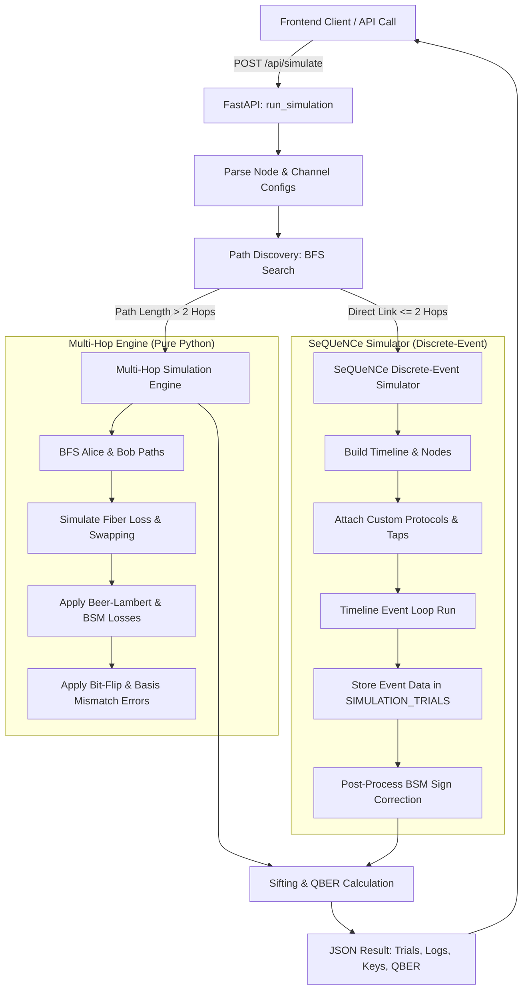

# SeQUeNCe QKD Multi-Hop Network Backend (`main.py`)

This README provides a comprehensive guide to the backend service of the Quantum Key Distribution (QKD) simulator. 

This FastAPI-based backend simulates quantum key distribution over both **direct single-hop fiber lines** (using the discrete-event simulation package **SeQUeNCe**) and **dynamic multi-hop topologies** (using a custom-built physical simulation engine).

---

## 1. High-Level Architecture

The backend serves as a middleware api between a frontend network visualizer/controller and quantum simulation engines. It takes a dynamic topology configuration (nodes, components, quantum/classical channels) and determines the best execution path to simulate entanglement and key generation.



---

## 2. API Schema and Config Models

The POST request to `/api/simulate` expects a `SimulationConfig` payload, defined using Pydantic models:

*   **`SimulationConfig`**:
    *   `numTrials`: `int` — Total number of photons/entanglement pairs to generate and measure.
    *   `nodes`: `List[NodeConfig]` — Graph representing the simulation network.
    *   `channels`: `List[ChannelConfig]` — Quantum and classical channels linking the nodes.
    *   `selectedPair`: `Optional[SelectedPair]` — Dict specifying which nodes act as `alice` and `bob`. If omitted, the engine falls back to looking for endpoint nodes containing the words "alice" or "bob" in their IDs.
*   **`NodeConfig`**:
    *   `id`: `str`, `name`: `str`, `type`: `"endpoint" | "repeater" | "bsm" | "source"`
    *   `components`: `List[ComponentConfig]` (e.g., SPDC source, detector efficiency/dark counts).
*   **`ChannelConfig`**:
    *   `id`: `str`, `name`: `str`, `type`: `"quantum" | "classical"`
    *   `src`: `str`, `dst`: `str`
    *   `distance`: `float` (in meters, defaults to `1000.0`)
    *   `attenuation`: `float` (in dB/m, defaults to `0.0002` or `0.2 dB/km`)
    *   `fidelity`: `float` (channel polarization fidelity, defaults to `0.95`)
    *   `delay`: `float` (classical propagation delay, defaults to `1e-6` s)

---

## 3. How the Simulation Works

The simulation executes in one of two modes based on path length and topology configuration.

### A. Multi-Hop Mode (Entanglement Swapping / Repeaters)
When intermediate repeater nodes exist between the quantum source and the endpoints (making the path longer than a single direct link), the backend runs a high-performance physical simulation engine.

#### 1. Path Discovery
*   Uses a **Breadth-First Search (BFS)** graph traversal (`_find_path_bfs`) on the active quantum channels.
*   Discovers the optimal path from available `source` (SPDC) nodes to the designated `alice` and `bob` nodes:
    $$\text{Path}_{\text{Alice}}: [S, N_1, \dots, A] \quad \text{and} \quad \text{Path}_{\text{Bob}}: [S, N_2, \dots, B]$$

#### 2. Photon Propagation & Loss (Beer-Lambert Law)
*   For each hop along the path, transmissivity $T$ is computed based on distance ($L$) and attenuation ($\alpha$ in dB/meter):
    $$\text{Loss}_{\text{dB}} = \alpha \times L$$
    $$T = 10^{-\frac{\text{Loss}_{\text{dB}}}{10}}$$
*   A random check determines if a photon survives the fiber hop. If a random value $r > T$, the photon is lost (`loss = True`).

#### 3. Entanglement Swapping
*   At intermediate repeater nodes, Bell State Measurements (BSM) are simulated:
    *   **Swap Efficiency**: Has a realistic success rate modeled at **84%** ($P_{\text{swap\_success}} = 0.84$). If a random check fails, the entanglement connection is severed, resulting in a loss for that trial.
    *   **Fidelity Penalty**: Each swapping event incurs a cumulative penalty of **2%** (modeled by multiplying fidelity by `0.98`).
*   The cumulative fidelity for the path is calculated as:
    $$\text{Fidelity}_{\text{path}} = \prod_{\text{hops}} \text{Fidelity}_{\text{channel}} \times (0.98)^{N_{\text{swaps}}}$$

#### 4. Measurement & Sifting
*   If both photons survive, Alice and Bob choose random bases (0 or 1, corresponding to Rectilinear/Diagonal).
*   If bases match, they measure matching results, subject to **bit-flip errors** governed by path fidelity:
    *   If a random float is greater than the computed path fidelity, the bit is flipped ($1 - \text{result}$).
*   If bases mismatch, Alice and Bob measure uncorrelated bits.
*   Trials with matching bases where both photons survived contribute to the final **Sifted Key**.

---

### B. Direct Mode (SeQUeNCe Discrete-Event Simulator)
For single-hop direct topologies, the backend constructs a discrete-event execution queue using the **SeQUeNCe** simulation library.

```
[ Alice ] <====== (Quantum Channel A) ====== [ SPDC Source ] ===== (Quantum Channel B) ======> [ Bob ]
```

#### 1. Component Mapping
*   **Timeline**: A discrete-event controller (`Timeline`) manages quantum state tracking and scheduled events in picosecond resolution.
*   **TrackedSPDCSource**: A custom `SPDCSource` component that generates entangled Bell pairs ($|\Phi^+\rangle = \frac{1}{\sqrt{2}}(|00\rangle + |11\rangle)$) and stamps them with a unique `trial` ID for tracking.
*   **Quantum/Classical Channels**: Fiber channels modeled with attenuation, delay, and polarization fidelity.
*   **SimParticipantProtocol**: Placed on Alice/Bob nodes. Includes a custom `PhotonTap` entity which intercepts incoming photons. It chooses a measurement basis at random, invokes `Photon.measure()`, and writes the results directly to the global `SIMULATION_TRIALS` thread-safe tracker.
*   **SimBSMProtocol**: Placed on `bsm` (Bell State Measurement) nodes to check for two-photon coincidence and returns a Bell state measurement index (0 to 3).

#### 2. BSM Correction / Phase Sign Flips
If a central BSM node performs the measurement, the resulting entangled states might have anti-correlations or phase offsets depending on which Bell State is measured:
*   $0 = |\Phi^+\rangle$ (No correction required, identical outcomes)
*   $1 = |\Phi^-\rangle$ (Phase shift — Bob's outcome must be flipped: `bob_r = 1 - bob_r`)
*   $2 = |\Psi^+\rangle$ (Anti-correlated states — Bob's outcome is aligned)
*   $3 = |\Psi^-\rangle$ (Phase-shifted anti-correlated states — Bob's outcome must be flipped: `bob_r = 1 - bob_r`)

---

## 4. Key Computations & Statistics

Regardless of simulation mode, the final output includes:

*   **Sifting**: Discards any trials where:
    1.  Either Alice's or Bob's photon was lost.
    2.  The chosen measurement bases were different ($B_A \neq B_B$).
*   **QBER (Quantum Bit Error Rate)**: The ratio of mismatched bits in the sifted key to the total length of the sifted key:
    $$\text{QBER} = \frac{\sum_{i=1}^{N} (b_{A, i} \oplus b_{B, i})}{N} \times 100\%$$
*   **Simulation Logs**: An execution trace detailing path routes, hop counts, sifted key lengths, and computed QBER.

---

## 5. Setup & Execution

### Prerequisites
Make sure Python 3.8+ is installed with the required dependencies:
```bash
pip install fastapi uvicorn pydantic
```
*(Ensure the `sequence` simulator package is located in your python path or parent directory).*

### Running the Server
Launch the backend using Uvicorn:
```bash
python main.py
```
This runs the API on `http://localhost:8000` with hot-reloading enabled.

### API Endpoints
*   `POST /api/simulate`: Submits a topology configuration and returns the sifting results.
*   `GET /api/health`: Health-check endpoint validating backend server responsiveness.
