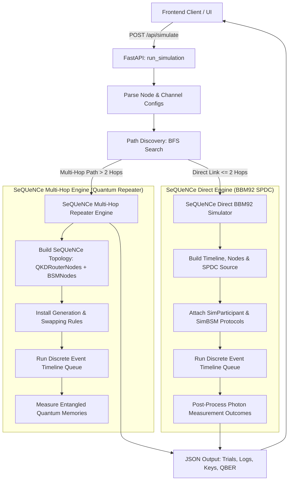

# ChaQra - Quantum Network Simulator Backend (`main.py`)

This README provides a detailed technical reference for the backend service of the Quantum Key Distribution (QKD) simulator, located in [backend/main.py](file:///c:/Users/xprin/Desktop/quantum-qkd/backend/main.py). 

The backend is built with **FastAPI** and uses the **SeQUeNCe** quantum network simulation library for both **direct single-hop BBM92 key generation** and **multi-hop quantum repeater entanglement distribution**.

---

## 1. High-Level Architecture

The backend receives dynamic network configurations from the frontend (nodes, components, quantum/classical channels) and selects the appropriate SeQUeNCe simulation mode:



---

## 2. Simulation Modes

### A. Direct Single-Hop Mode (BBM92 Protocol)
For direct links between Alice and Bob via a quantum source node:
* **Entanglement Source**: Uses `TrackedSPDCSource` (subclass of `SPDCSource`) emitting polarization-entangled photon pairs $|\Phi^+\rangle = \frac{1}{\sqrt{2}}(|HH\rangle + |VV\rangle)$.
* **Channel Propagation**: Photons pass through `QuantumChannel` components with physical distance attenuation, transmission loss, and polarization noise.
* **Measurement**: Endpoints measure photons in random Rectilinear ($Z$) or Diagonal ($X$) bases using `QSDetectorPolarization`.
* **BSM Correction**: If a central Bell State Measurement station is used, phase-shift corrections are applied post-measurement ($|\Phi^-\rangle$ / $|\Psi^-\rangle$).

---

### B. Multi-Hop Mode (SeQUeNCe Quantum Repeater)
For paths with intermediate repeater nodes, the backend builds a discrete-event simulation model using SeQUeNCe's rule-based resource management stack:

1. **Topology Mapping**:
   - **`QKDRouterNode`**: Custom router node hosting a `MemoryArray` and a local `ResourceManager`.
   - **`BSMNode`**: Intermediate measurement station positioned between adjacent routers. If adjacent routers do not have a BSM station between them, a virtual `BSMNode` is automatically inserted.
   - **Quantum & Classical Channels**: Installed with physical attenuation, delay, and polarization fidelity based on frontend channel configurations.

2. **Rule-Based Entanglement Protocol Stack**:
   - **Link Entanglement Generation**: Router nodes load `EntanglementGenerationA` rules targeting adjacent `BSMNodes`. Adjacent quantum memories emit photons to the central `BSMNode` for heralded pair generation.
   - **Entanglement Swapping**: Intermediate repeater nodes evaluate `EntanglementSwappingA` rules when memories with both left and right neighbors reach `ENTANGLED` status. Performing a Bell State Measurement on the stored states swaps entanglement to distant end nodes while freeing intermediate memories. End nodes run `EntanglementSwappingB` rules to receive swap result notifications and apply Pauli corrections ($X/Z$).

3. **Memory Properties & UI Configuration**:
   The multi-hop engine reads component properties directly from the frontend payload:
   - `num_memories`: Number of memory slots per router.
   - `fidelity`: Raw state fidelity of the quantum memories.
   - `coherence_time`: Memory state decay time ($s$).
   - `efficiency`: Excitation efficiency.
   - `frequency`: Emission rate ($Hz$).
   - `wavelength`: Emission wavelength ($nm$).

---

## 3. Key Computations & Statistics

* **Sifting**: Filters out trials where photons were lost or where Alice and Bob measured in mismatched bases ($B_A \neq B_B$).
* **QBER (Quantum Bit Error Rate)**:
  $$\text{QBER} = \frac{\sum_{i=1}^{N} (b_{A, i} \oplus b_{B, i})}{N} \times 100\%$$
* **Key Generation Output**: Returns sifted keys for Alice and Bob along with step-by-step simulation logs and trial data for UI animation playback.

---

## 4. Setup & Running

### Prerequisites
Install backend dependencies:
```bash
pip install fastapi uvicorn pydantic sequence
```

### Run Server
```bash
python main.py
```
The server will run on `http://localhost:8000`.

### API Endpoints
* `POST /api/simulate`: Main simulation endpoint accepting topology, node component parameters, channels, and trial counts.
* `GET /api/health`: Health status endpoint.
